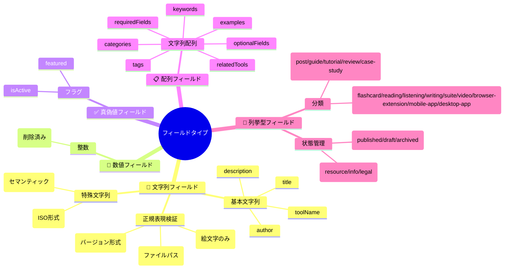

# GoRakuDo Content Collections 設定ガイド

## 📋 概要

このディレクトリは、GoRakuDoサイトのコンテンツ管理システム（Content Collections）の設定ファイルとコンテンツファイルを格納しています。

## 🗂️ ディレクトリ構造

```
src/content/
├── config.ts              # メイン設定ファイル
├── README.md              # このファイル
├── docs/                  # メインコンテンツ（ブログ記事、ガイド）
├── templates/             # 記事作成用テンプレート
├── pages/                 # 静的ページ（サポートページなど）
└── tool-articles/         # ツール紹介記事
```

## 🧠 MindMaps構造

### 📊 Content Collections 全体構造


### 🔧 設定定数構造


### 📝 フィールドタイプ別分類



## 🎯 各コレクション詳細

### 📚 docs コレクション

**用途**: メインコンテンツ（ブログ記事、ガイド、チュートリアル）  
**場所**: `src/content/docs/`  
**必須フィールド**: title, description, publishedDate

#### フィールド構造


### 📝 templates コレクション

**用途**: 記事作成用テンプレート管理  
**場所**: `src/content/templates/`  
**必須フィールド**: templateName, templateType, description, lastUpdated, templateContent

#### フィールド構造


### 📄 pages コレクション

**用途**: 静的ページ（サポートページ、お知らせ、法的ページ）  
**場所**: `src/content/pages/`  
**必須フィールド**: title, description, publishedDate

#### フィールド構造


### 🛠️ tool-articles コレクション

**用途**: 学習ツールの紹介・解説記事  
**場所**: `src/content/tool-articles/`  
**必須フィールド**: title, description, publishedDate, toolName, toolCategory

#### フィールド構造


## 🔧 設定変更ガイド

### よくある設定変更

#### 1. 文字数制限の変更
```typescript
// LIMITS オブジェクトの値を変更
const LIMITS = {
  TITLE_MAX: 100,  // 100 → 150 に変更
  // ...
} as const;
```

#### 2. デフォルト値の変更
```typescript
// DEFAULTS オブジェクトの値を変更
const DEFAULTS = {
  AUTHOR: 'Tim GoRakuDo',  // 新しい作者名に変更
  // ...
} as const;
```

#### 3. 選択肢の追加・変更
```typescript
// z.enum() の配列に項目を追加
toolCategory: z.enum([
  'flashcard',
  'reading',
  'new-category',  // 新しいカテゴリを追加
  // ...
])
```

#### 4. 新しいフィールドの追加
```typescript
// 各コレクションのschemaに新しいフィールドを追加
schema: z.object({
  // 既存のフィールド...
  newField: z.string().optional(),  // 新しいフィールドを追加
})
```

## ⚠️ 変更時の注意事項

1. **既存コンテンツの確認**: 変更前に既存のコンテンツファイルが新しい設定に準拠しているか確認
2. **ビルドテスト**: 変更後は必ず `npm run build` でビルドテストを実行
3. **破壊的変更**: 必須フィールドの追加など、破壊的変更の場合は既存コンテンツの更新が必要
4. **バックアップ**: 重要な変更前は設定ファイルのバックアップを取る

## 📞 サポート

設定変更で不明な点がある場合は、技術チームにご相談ください。

## 🔗 関連リンク

- [Astro Content Collections公式ドキュメント](https://docs.astro.build/ja/guides/content-collections/)
- [Zodバリデーションライブラリ](https://zod.dev/)
- [GoRakuDoプロジェクトメインREADME](../README.md)
